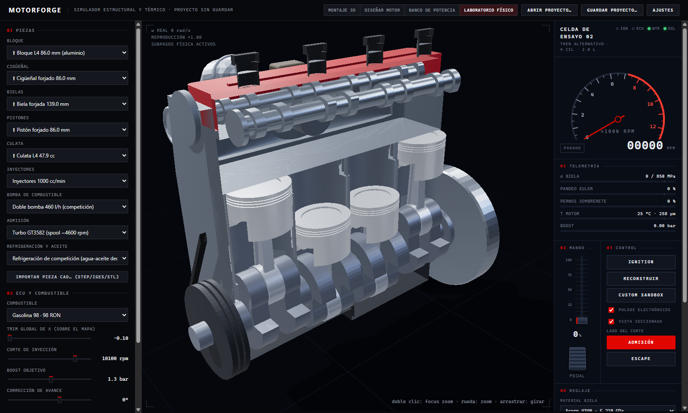
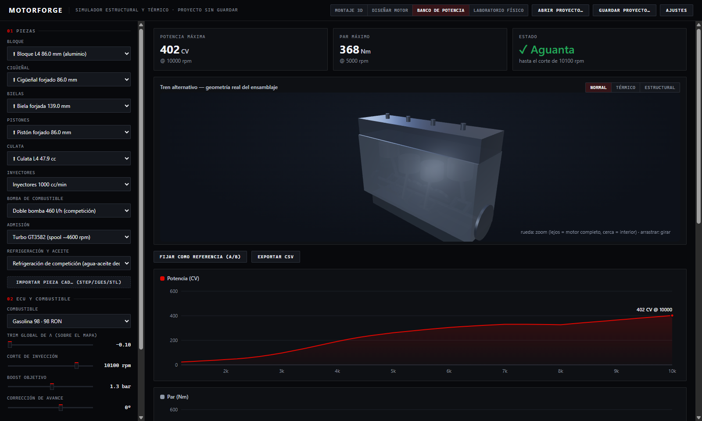

# MotorForge

Offline desktop app that simulates an internal-combustion engine and explains every failure
with its **causal chain**:

```
boost 2.4 bar → peak pressure 190 bar → con-rod load 82 kN > buckling limit 74 kN
```



> **Status: in development.** Today it simulates **one built-in reference engine** end to end.
> Building your own engines (3D assembler, engine designer, importing your parts) is work in
> progress.

## Works today (reference engine)

- **Engine model** — 0D single-zone Otto cycle (Wiebe combustion, Woschni-style heat transfer,
  Chen-Flynn friction), dyno curves (power/torque vs RPM), knock from required octane, ECU maps
  (λ and ignition advance over RPM × load) and fuel system.
- **Explainable failures** — every term in the physics model records its dependencies, so a
  failure event carries the chain of causes that produced it.
- **Physics lab** — the reciprocating assembly as Rapier rigid bodies with revolute and prismatic
  joints; breakage destroys joints and frees parts. Synthesised engine audio and F1-style telemetry.
- **Endurance runs** — accumulated wear (Miner fatigue, ring-land pitting, thermal creep,
  bearings) that persists between runs.
- **Projects** — save/open `.mforge.json`, A/B dyno comparison, run history and CSV export.



## In progress

- **3D assembler** — import your own CAD parts (STEP/IGES/STL), tag what each mesh is, and
  measure bore, stroke, rod length and chamber volume from the geometry.
- **Engine designer** — author engines beyond the reference one, with limits derived by
  scaling laws.
- **Limits from geometry** — analytic limits (Euler buckling, Lamé, Goodman) and a voxel FEA
  solver (matrix-free conjugate gradient) for imported parts.

## Design principles

1. **Explainable** — no failure without a cause chain.
2. **One limits contract** — the simulation consumes `DerivedLimit[]` regardless of where a
   limit comes from (catalogue, formulas, voxel FEA or manual input).
3. **Deterministic** — same engine + same config ⇒ same result, so failures are reproducible.
4. **Simplified but coherent physics** — never dynamic CFD/FEA.

See [ARCHITECTURE.md](ARCHITECTURE.md) for the full design (in Spanish).

## Stack

Electron · electron-vite · React 19 · TypeScript · Zustand · Three.js / React Three Fiber ·
Rapier (WASM) · occt-import-js · three-mesh-bvh · Vitest (178 tests)

## Run it

```bash
npm install
npm run dev        # development
npm test           # Vitest suite
npm run typecheck
npm run dist       # build + Windows installer (electron-builder)
```
